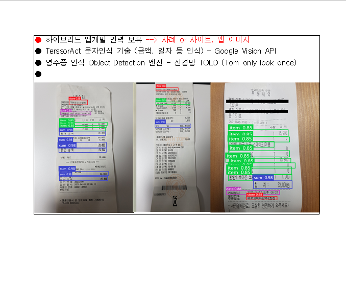

<h1 align="center">대학교 활동과 경험들</h1>

## :clap: KDB 스타트업 공모전
인공지능 수업을 듣던중 관련 사업아이템이 떠올라 동기들과 
영수증 인식 AI를 이용한 세무사 애플리케이션 사업 아이템으로 사업계획서를 작성하여 KDB 스타트업 공모전에 출전하였다

## :clap: D.O 창업 동아리 활동/ 2021학년도 산업체 연계 캡스톤디자인  경진대회
유모차 전방에 카메라를 달아 코너에서 갑작스럽게 튀어나올 수 있는 차량, 사람 등을 감지 모델로 구분하여 위급상황을 대처할 수 있는 스마트 유모차 
2021학년도 산업체 연계 캡스톤 디자인 경진대회에서 장려상과 교내 우수 창업동아리 선발 경진대회에서 대상을 수상했다

## :tada: 수상

